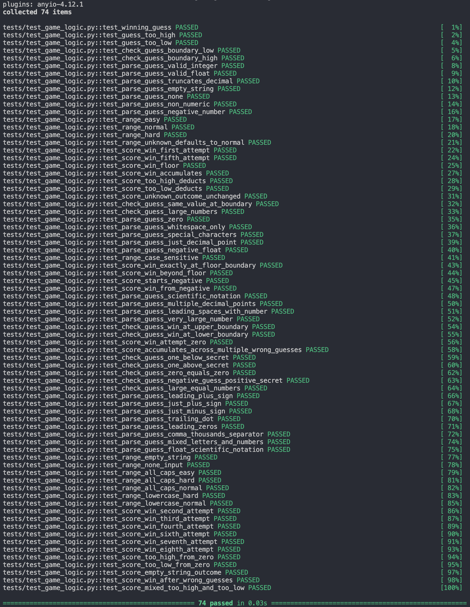
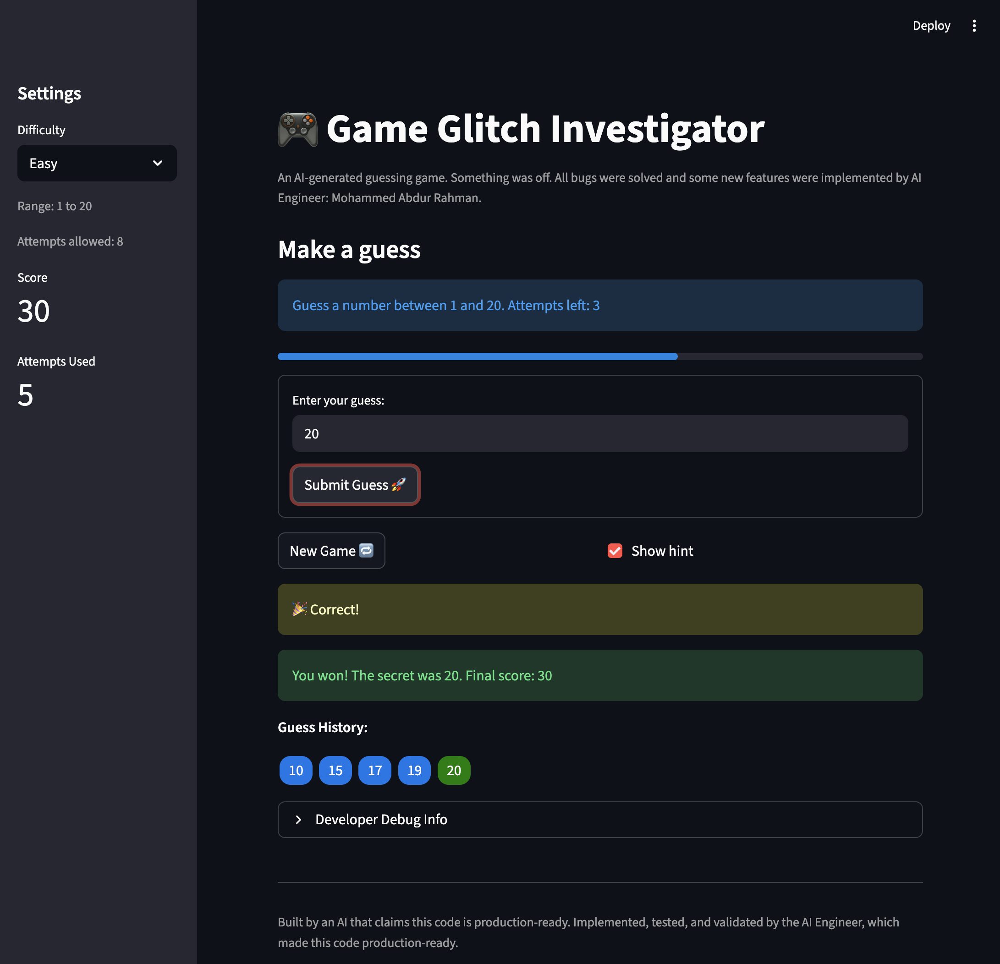

# 🎮 ArchRefactor

A Streamlit number guessing game, originally generated by AI with intentional bugs, fully debugged, refactored, tested, and enhanced by me.

## 🚀 Live Features

- Guess a secret number within a limited number of attempts
- Three difficulty levels: **Easy** (1–20), **Normal** (1–50), **Hard** (1–100)
- Score system — fewer attempts means a higher score
- Real-time feedback with directional hints
- Colored guess history badges (red: too high, blue: too low, green: win)
- Progress bar tracking attempts used
- Sidebar metrics showing live score and attempts
- Full game reset on New Game or difficulty switch
- Enter key submits the guess (form-based input)

## 🛠️ Tech Stack

- **Python**. - Version 3.13.0
- **Streamlit** — UI and session state management
- **pytest** — Automated testing (74 tests)
- **Manual Testing** — comprehensive Blackbox testing to verify all edge cases and UI interactions

## 🔧 Setup

```bash
pip install -r requirements.txt
python -m streamlit run app.py
```

## 🕵️ What I Did + ⚙️ AI Engineering Workflow

The original AI-generated code had multiple bugs making the game unplayable. I investigated, fixed, refactored, and expanded it into a polished, tested application using a combination of manual debugging and AI-assisted code editing. The result is a fully functional number guessing game with a clean codebase and comprehensive test coverage.

- **Governance rules** — custom `.md` rule files under `.claude/rules/` enforced coding standards, comment guidelines, testing requirements, and change log discipline throughout the entire project
- **Change log discipline** — every approved change was documented in `change_log.txt` with a date, affected files, and a plain-language summary before moving to the next fix
- **Plan mode** — used structured planning before implementing multi-step changes to align on approach and scope before any code was touched
- **Approve before edit** — no code change was applied without first reviewing a written explanation of what would change and why; all edits required explicit approval
- **Manual verification** — every fix was verified by running the app and confirming the expected behavior, not just relying on tests passing
- **Incremental fixing** — bugs were addressed one at a time in isolation, making it easy to attribute regressions and confirm each fix independently

**Bugs fixed:**

| # | Bug | Fix |
|---|-----|-----|
| 1 | **Secret number reset on every submit** — the secret was regenerated on every Streamlit rerun, making it impossible to win | Stored the secret in `st.session_state` so it is generated once and persists for the entire game |
| 2 | **Backwards hints** — "Too High" told the player to go higher, "Too Low" told them to go lower | Swapped the hint messages so each outcome gives the correct directional instruction |
| 3 | **String conversion glitch** — the secret was cast to a string on even-numbered attempts, causing comparisons to fail every other guess | Removed the type cast so the secret always stays an integer |
| 4 | **Attempts counter off by one** — the counter started at 1, showing 1 attempt used before any guess was submitted | Changed initialization to 0 and moved the increment to only fire after a valid, in-range guess |
| 5 | **New Game button incomplete reset** — clicking New Game kept the old history, score, and game status, breaking subsequent rounds | Added resets for `history`, `score`, and `status` in the New Game handler |
| 6 | **Score display mismatch** — the Developer Debug Info panel showed the pre-submission score because it was rendered before the submit handler ran | Moved the debug expander to after the submit handler so it always reads the updated value |
| 7 | **Attempts left showing 1 on the final attempt** — the attempts banner was rendered before the increment, always displaying one step behind | Replaced `st.info` with an `st.empty()` placeholder filled after the increment |
| 8 | **Score formula off by one** — win points used `attempt_number + 1`, so a first-attempt win awarded 80 instead of the correct 90 | Removed the `+ 1` so the formula correctly computes `100 - 10 * attempt_number` |
| 9 | **Even/odd scoring asymmetry** — "Too High" deducted a different number of points on even vs odd attempts | Collapsed the two branches into a single condition that always deducts 5 points, matching "Too Low" |
| 10 | **Enter key did not submit** — the text input was not inside a form, so pressing Enter had no effect | Wrapped the input and button in `st.form` so Enter triggers submission |
| 11 | **Difficulty ranges incorrect** — Normal and Hard used wrong upper bounds, so the secret could fall outside the displayed range | Updated `get_range_for_difficulty` to return the correct ranges: Normal 1–50, Hard 1–100 |
| 12 | **Attempt limits out of sync** — each difficulty had a different attempt limit, causing mismatches between the sidebar and the info banner | Set all difficulty levels to 8 attempts so both displays always agree |
| 13 | **Out-of-range guesses counted as attempts** — entering a number outside the difficulty range consumed an attempt | Added range validation before the increment; invalid guesses show an error and are not counted |
| 14 | **Game state not resetting on difficulty switch** — changing difficulty mid-game kept the old secret, score, and history | Added difficulty tracking in `st.session_state`; any change triggers a full game reset |
| 15 | **Wrong fallback range** — unrecognized difficulty strings defaulted to (1, 100) instead of the Normal range (1, 50) | Changed the fallback `return` in `get_range_for_difficulty` to `(1, 50)` |
| 16 | **"New game started." message never appeared** — the `st.success()` call was placed before `st.rerun()`, which discards all rendered elements | Replaced with a session state flag (`show_new_game_msg`) checked on the next rerun |
| 17 | **Exception handling too broad** — `parse_guess` caught all exceptions, masking unexpected errors | Narrowed to `except ValueError` so only invalid number formats are silently handled |
| 18 | **Empty gap in attempts banner on game over** — the placeholder was only filled inside the submit handler, leaving a blank space when the game was won or lost | Filled the placeholder immediately on creation so it is never blank |
| 19 | **Progress bar one step behind** — rendered before the submit handler ran, always reflecting the previous attempt count | Replaced `st.progress()` with an `st.empty()` placeholder filled after the submit handler |
| 20 | **Submit button active after game ended** — the form remained fully interactive after a win or loss, allowing extra guesses | Added `disabled=st.session_state.status != "playing"` to the submit button so it grays out when the game is over |

**Refactoring:**
- Extracted all game logic into `logic_utils.py` (`parse_guess`, `check_guess`, `update_score`, `get_range_for_difficulty`)
- `app.py` imports from `logic_utils.py` — clean separation of UI and logic

**Testing:**
- Built a pytest suite of **74 tests** covering all logic functions
- Edge cases include: scientific notation, comma separators, leading zeros, trailing dots, negative floats, all-caps difficulty strings, score floor clamping, and multi-step game simulations

```bash
pytest tests/test_game_logic.py -v
```

**Stretch UI Enhancements:**
- Sidebar score and attempts as `st.metric` displays
- Visual progress bar synced to post-submission attempt count
- Colored guess history badges rendered with inline HTML
- Logical visual container grouping the guess section

## 📸 Demo



